# Project Report on skin lesions: Group B

## Why do we need to work on this topic and investigate skin lesions?

Skin lesions are a common health issue that affects millions of people worldwide.  
Skin lesions are areas of your skin that are different from the skin around them.  
Skin lesions detection can help to solve the problem with skin cancer diagnosis.  

In the **"Skin Lesion Extraction And Its Application"** Master thesis of Yanliang Gu at "Michigan Technological University" this problem was explored.  

Yanliang Gu focuses on developing a skin lesion detection algorithm to aid in skin cancer diagnosis.  
The proposed algorithm utilizes color information and thresholding techniques, with an emphasis on evaluating various color spaces to determine optimal performance.  
Experimental results indicate that the YUV color space yields the best detection outcomes.  
Additionally, Gu introduces a distance histogram-based threshold selection method, which outperforms other adaptive thresholding techniques in color detection tasks.  
The thesis also explores GPU acceleration methods to enhance the speed of skin lesion extraction processes, demonstrating the potential for significant performance improvements. To improve the efficiency of skin lesion extraction, the thesis explores GPU acceleration methods, demonstrating significant performance improvements in real-time processing. Building upon these findings, Gu developed a mobile application that integrates the optimized detection algorithm, making automated skin cancer diagnosis more accessible to both medical professionals and the general public.

Building upon these findings, Gu developed a mobile application for skin cancer diagnosis. 

As part of our research on skin lesions, we will:

- **Analyze a dataset** of skin lesion images, ensuring a diverse range of samples for robust evaluation.
- **Assess the presence of hair** in the images, which can obstruct lesion detection and lead to false positives or segmentation errors.
- **Make detailed annotations** to label lesion boundaries, hair obstructions, and other relevant skin features.
- **Implement hair segmentation techniques** to remove hair artifacts from the images, improving lesion visibility and accuracy in automated detection.
- **Draw appropriate conclusions** regarding the effectiveness of different segmentation techniques and explore potential refinements to the algorithm.

## Data observation

Here we will summarize what we can observe. Amount of pictures annotated by everyone

### Cohen's Kappa method to compare how often annotators agree
Cohen’s Kappa is a statistical measure used to assess the agreement between two annotators while accounting for the possibility of random agreement. Unlike simple percentage agreement, Cohen’s Kappa corrects for agreement that could occur by chance, providing a more accurate reflection of consistency between annotators. The values of Cohen’s Kappa range from -1 to 1, where 1 represents perfect agreement, 0 indicates agreement no better than chance, and negative values suggest systematic disagreement.

We've annotated pictures by marking it from 0 to 2. 0 means there is no hair, 1 - a little bit, 2 - a lof of hair. 

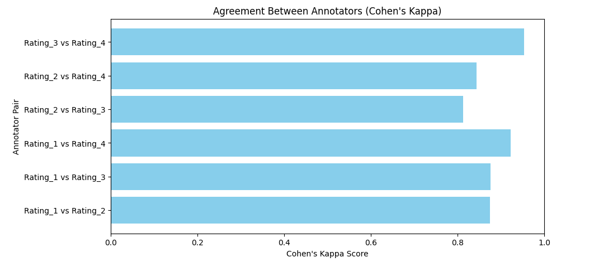

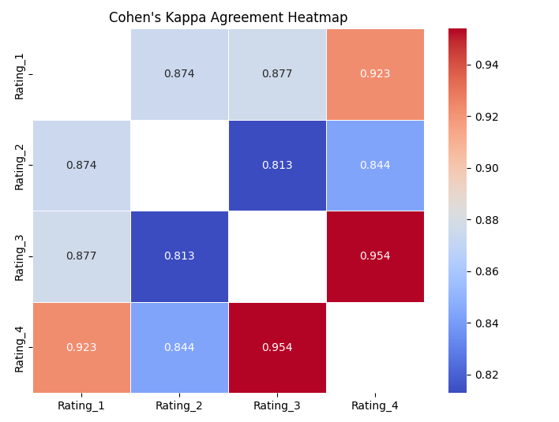 
### How can we interpret this agreement measure?
The heatmap presents Cohen's Kappa scores for different pairs of annotators (Rating_1, Rating_2, Rating_3, and Rating_4). Cohen's Kappa measures inter-rater agreement, correcting for chance agreement.
The highest agreement is between Rating_3 and Rating_4 (0.954).
Rating_1 generally has high agreement with other annotators (above 0.87).
Rating_2 seems to have slightly lower agreement scores compared to the others.
Rating_4 has the strongest agreement overall, especially with Rating_3 (0.954) and Rating_1 (0.923).

The asymmetry in agreement values (e.g., Rating_1 vs. Rating_3 is 0.877, while Rating_3 vs. Rating_1 is slightly different) may indicate differences in individual rating tendencies.

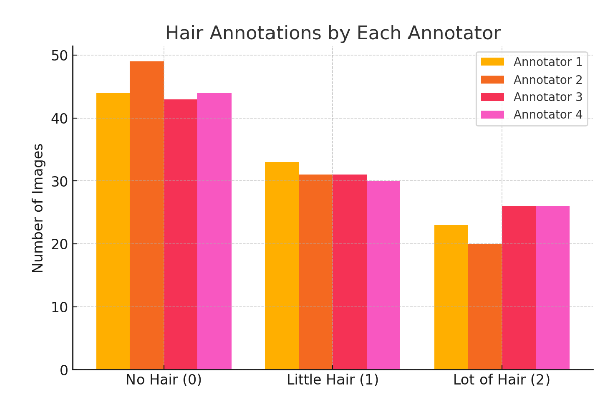 

The dataset analysis (result.csv) shows that for images with no hair (annotation 0), Annotator 1 marked 44 images, Annotator 2 marked 49, Annotator 3 marked 43, and Annotator 4 marked 44. For images with a little bit of hair (annotation 1), Annotator 1 assigned this rating to 33 images, Annotator 2 to 31, Annotator 3 to 31, and Annotator 4 to 30. In cases where there was a lot of hair (annotation 2), Annotator 1 recorded 23 images, Annotator 2 recorded 20, Annotator 3 recorded 26, and Annotator 4 recorded 26. 

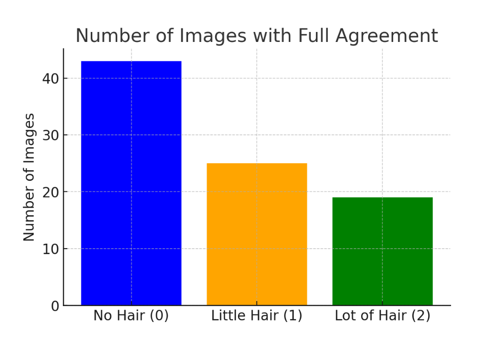 

The dataset analysis shows that 43 images were annotated with 0 (no hair) by all four annotators, 25 images were annotated with 1 (a little bit of hair) by all annotators, and 19 images were annotated with 2 (a lot of hair) by all annotators. This indicates a higher level of agreement among annotators when identifying images without hair compared to those with some or a lot of hair.

## TELEA method to remove the hair from picture

 The TELEA algorithm is based on the paper “An Image Inpainting Technique based on the Fast Marching method” by Alexandru Telea in 2004. It is based on the Fast Marching Method (FMM), a solutional paradigm which builds a solution outwards starting from the “known information” of a problem and it is a numerical method created by James Sethian. 
 
## How does TELEA work?
The first step in any inpainting method is to identify the region to be inpainted. There is the region to be inpainted, also known as the unknown region, and the surrounding known region of the image. The algorithm first considers the boundary of the unknown region, and inpaints one pixel lying on the boundary. Then it iterates over all the pixels lying on the boundary to inpaint the whole boundary. 

A single pixel is inpainted as a function of all other pixels lying in its known neighborhood by summing the estimates of all pixels, normalized by a weighting function. A weighting function is necessary as it ensures the inpainted pixel is influenced more by the pixels lying close to it and less by the pixels lying far away. After the boundary has been inpainted, the algorithm propagates forward towards the center of the unknown region. To implement the propagation, the Fast Marching Method (FMM) is used. FMM ensures the pixels near the known pixels are inpainted first, so that it mimics a manual inpainting technique. 

## Comparison with other methods

| Method                  | Filling Order   | Speed    | Edge Preservation | Complexity |
|-------------------------|----------------|---------|------------------|------------|
| **Basic Diffusion**     | Random         | Slow    | Poor             | High       |
| **Convolution-based**   | Iterative      | Moderate | Moderate        | Medium     |
| **FMM-based (Telea)**   | Priority Queue | Fast    | Strong          | Low        |

Basic diffusion methods: Basic diffusion methods involve iteratively updating pixel values based on their neighbors, often leading to slow convergence and potential noise amplification. This approach does not prioritize which pixels to inpaint next, making it less efficient. It also tends to blur edges and details, which is not ideal for preserving lesion structures. 

Convolution-based methods: Use fixed-size kernels to iteratively update pixel values in the image. These methods apply the kernel to the image at each step, effectively blending pixel values based on their neighbors. Convolution-based methods can be faster than basic diffusion howeber, they still suffer from edge blurring because they often treat all regions equally, including sharp transitions between colors or textures. This is not ideal when preserving lesion structures. Furthermore, these methods may require multiple iterations to produce satisfactory results, which increases the computational cost. The complexity of these methods are high, as each iteration requires repeated convolutions across the image.

## What makes TELEA (Fast Marching Method-based Inpainting superior to other methods?
The FMM explicitly maintains a narrow band that separates the known from the unknown image area and specifies which pixel to inpaint next.

Efficient Propagation – FMM efficiently propagates information outward from known regions to unknown regions, ensuring a smooth inpainting process.

Speed – FMM is faster than traditional iterative methods since it follows a priority-driven approach, making it well-suited for real-time applications.

Accuracy – It helps maintain edge continuity and structure while filling missing regions by propagating pixel values based on their distance to the known region.

Stable Computation – Unlike purely iterative approaches that may introduce noise, FMM ensures a stable and controlled spread of information.

Optimized Memory Usage – FMM processes pixels in an ordered manner, reducing unnecessary computations and improving memory efficiency.

## Why is TELEA a good choice for hair removal in skin lesion analysis?

The TELEA (Fast Marching Method-based Inpainting) algorithm is a good choice for hair removal/segmentation in skin lesion analysis for several reasons.
The algorithm fills in the missing pixels by propagating information from the surrounding known pixels in a smooth manner. This is particularly effective in cases where hair partially covers the lesion, as it avoids introducing sharp discontinuities.
Since hair strands are usually thin, removing them while preserving the underlying lesion structure is crucial. TELEA efficiently interpolates the missing values without distorting important lesion characteristics.

Many segmentation tasks rely on accurate lesion boundaries. TELEA ensures that hair occlusions do not lead to false lesion contours, which is important for automated diagnosis and feature extraction.

The TELEA method is widely used in skin lesion analysis because it effectively removes hair, noise, and other occlusions that can interfere with accurate lesion detection. In dermoscopic images, hair often covers parts of the skin lesion, making diagnosis difficult.
TELEA efficiently fills in the missing regions after hair removal, ensuring that the lesion remains clearly visible. Unlike simple blurring or interpolation, this method preserves the natural texture and edges of the lesion, preventing distortion of important diagnostic features such as borders, colors, and patterns.
## Visual results

**Overview:**  
This section presents four different examples demonstrating the process and effectiveness of image inpainting. Each example contains three images: the original (before), the inpainted version (after), and the generated mask.  

**Comparison:**  
- The **first two examples** (**bad examples**) illustrate cases where the inpainting process struggles, highlighting potential limitations.  
- The **last two examples** (**good examples**) showcase successful restorations, demonstrating optimal results.

## First image - img_0131 (Bad Example):

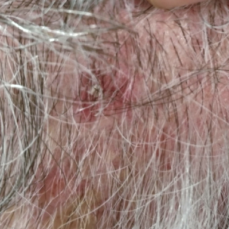

**First Image Before**

The image contains a large amount of white hair covering the skin lesion, making it difficult to detect.

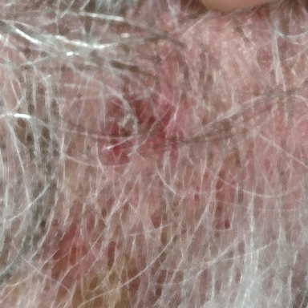

**First Image Inpainted**

The inpainting fails to remove the hair, leaving the lesion still obstructed. The image appears blurry, and no useful details are recovered.

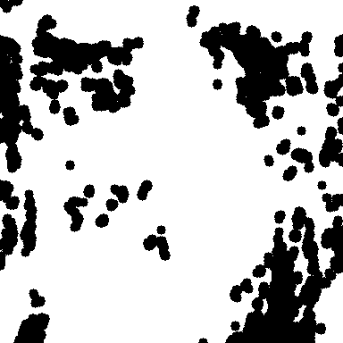

**First Image Mask**

The mask highlights random areas instead of the lesion, likely following the blurred hair strands. It does not improve lesion visibility.

**First Image Conclusion:**  
The TELEA method is ineffective in this case, as it does not properly remove hair or enhance the lesion for further analysis. Alternative segmentation techniques are needed.

## Second image - img_0183 (Bad Example):

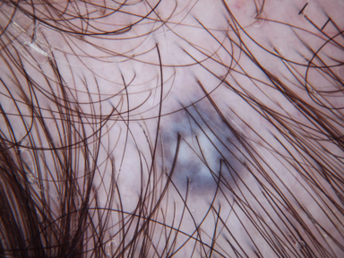

**Second Image Before**

The image shows a purple lesion with brown hair surrounding it. While the hair doesn’t cover the lesion completely, it still obscures some details.

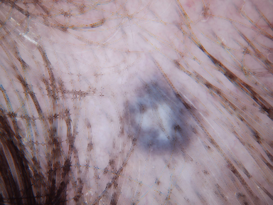

**Second Image Inpainted**

The inpainting smooths out some of the hair, but the area with the most hair remains blurry. The lesion is slightly more visible, but the hair hasn’t been fully removed, leaving some obstructions.

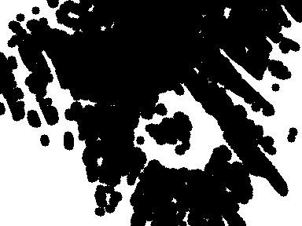

**Second Image Mask**

The mask highlights the white center of the lesion, but the purple and darker spots are not properly accentuated, reducing the lesion’s prominence.

**Second Image Conclusion:**  
While there is slight improvement in visibility, the TELEA method still doesn’t fully remove the hair or provide clear lesion boundaries. The mask doesn’t emphasize the lesion as needed, showing the need for further refinement in segmentation.

## Third image - img_0143 (Good Example):

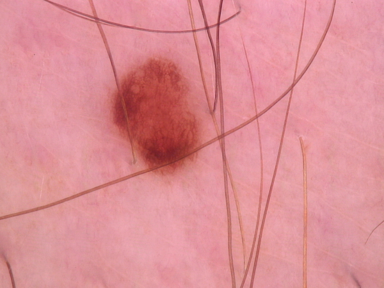

**Third Image Before**

A red lesion is visible in the center, surrounded by minimal hair, with the skin appearing pink.

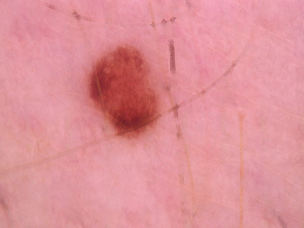

**Third Image Inpainted**

Almost all hair has been removed, leaving just a small trace, particularly where the hair concentration was highest. The lesion is much clearer now.

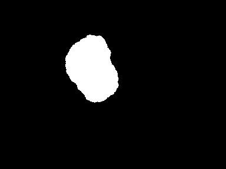

**Third Image Mask**

The lesion is clearly highlighted in white, with the rest of the image in black, successfully emphasizing the lesion.

**Third Image Conclusion:**  

The processing and mask have been highly successful in removing hair and clearly highlighting the lesion. This is an ideal example of effective hair segmentation.

## Fourth image - img_0170 (Good Example):

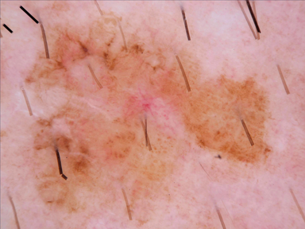

**Fourth Image Before**

A large, irregular yellow-orange lesion with some brown areas and a few short, thick black hairs around it.

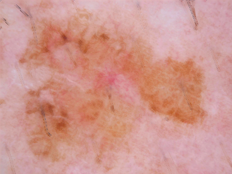

**Fourth Image Inpainted**

The majority of the hair has been removed, with only small traces remaining in certain areas. The lesion's visibility has improved significantly.

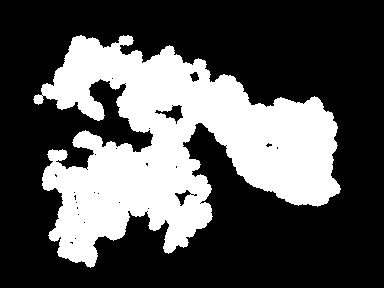

**Fourth Image Mask**

The lesion is highlighted in white, even though it is irregular and not highly concentrated. The mask effectively identifies the edges and boundaries of the lesion, showing good segmentation despite its irregular shape.

**Fourth Image Conclusion:**  

The processing and mask have successfully removed most of the hair and clearly defined the lesion's borders, demonstrating effective segmentation for a less concentrated, irregular lesion.

## Conclusion
In this project, we explored the effectiveness of the TELEA inpainting method for hair removal in skin lesion images. The process aimed to improve the visibility and accuracy of lesion detection, which is essential for automated skin cancer diagnosis.

Through analyzing four examples with different levels of hair coverage, we observed that the method performed well in some cases but struggled in others. In images with sparse or thicker hair, the TELEA algorithm was able to remove a significant portion of the hair, allowing for a clearer view of the underlying lesions. However, in cases with denser or finer hair, the results were less effective. In these instances, the hair removal was incomplete, and the lesion remained obscured, making it harder for the automated system to detect and segment the lesion accurately.

The mask images provided a valuable insight into the algorithm’s performance by highlighting the areas of the lesion and distinguishing them from the background. For lesions with less hair interference, the mask clearly outlined the lesion’s boundaries. However, in images with more complex hair coverage, the mask was less precise, often highlighting random areas or failing to isolate the lesion completely.

In conclusion, the TELEA inpainting method demonstrated its potential for skin lesion analysis, especially when dealing with sparse hair. For cases involving denser or finer hair, further refinements to the algorithm are necessary to improve its precision and ensure more reliable lesion detection. Continued research and optimization of hair segmentation methods will be essential to enhance the accuracy and efficiency of automated skin cancer detection systems.

